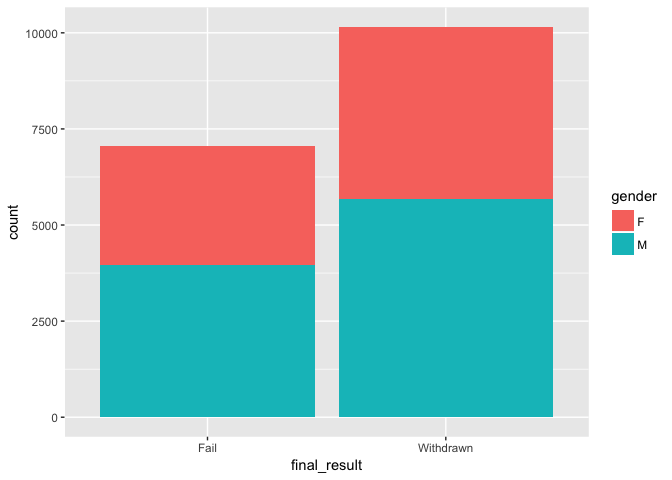
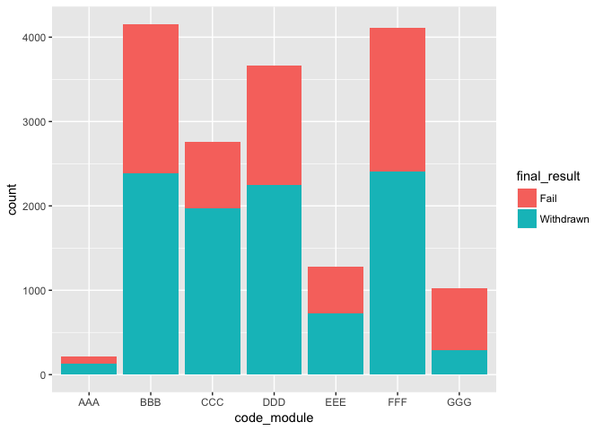
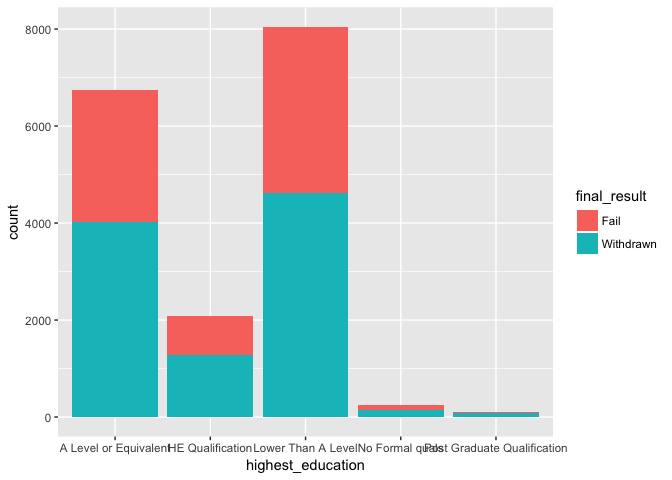
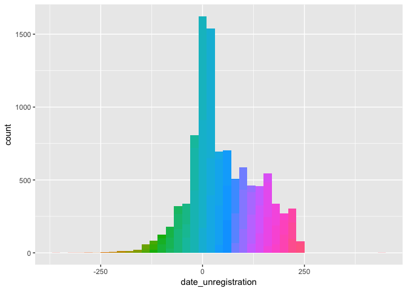
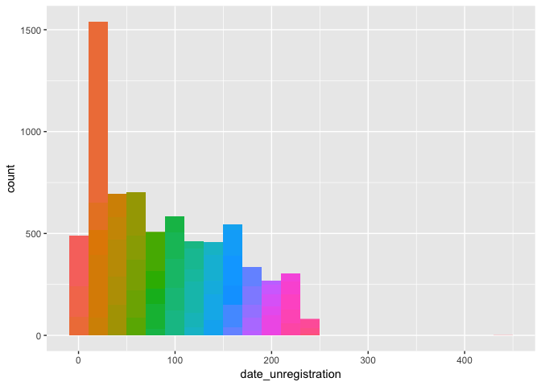

Introduction
------------

Open University Learning Analytics Dataset (OULAD) contains data about courses, students and their interactions with Virtual Learning Environment (VLE) for seven selected courses (called modules). Presentations of courses start in February and October - they are marked by "B" and "J" respectively. The dataset consists of tables connected using unique identifiers. Dataset is stored in several csv files. We start off the analysis by declaring various packages that we will use.

``` r
library(tidyverse)
library(data.table)
library(lubridate)
library(plotly)
```

Exploratory Data Analysis
-------------------------

We can now start reading in the csv files and explore the data within. The `tidyverse` package is ideally suited for all data wrangling operations. Since one of the csv files (`studentVle.csv`) is 432 MB in size, we will utilize the `fread()` function from the `data.table` package to speed up data ingestion.

``` r
assess <- read_csv("assessments.csv")
courses <- read_csv("courses.csv")
stuAssess <- read_csv("studentAssessment.csv")
stuInfo <- read_csv("studentInfo.csv")
stuReg <- read_csv("studentRegistration.csv")
stuVle <- fread("studentVle.csv")
```

    ## 
    Read 26.4% of 10655280 rows
    Read 75.1% of 10655280 rows
    Read 10655280 rows and 6 (of 6) columns from 0.423 GB file in 00:00:04

``` r
vle <- read_csv("vle.csv")
```

Biggest Problem Area
--------------------

Let's start off by exploring our students.

``` r
glimpse(stuInfo)
```

    ## Observations: 32,593
    ## Variables: 12
    ## $ code_module          <chr> "AAA", "AAA", "AAA", "AAA", "AAA", "AAA",...
    ## $ code_presentation    <chr> "2013J", "2013J", "2013J", "2013J", "2013...
    ## $ id_student           <int> 11391, 28400, 30268, 31604, 32885, 38053,...
    ## $ gender               <chr> "M", "F", "F", "F", "F", "M", "M", "F", "...
    ## $ region               <chr> "East Anglian Region", "Scotland", "North...
    ## $ highest_education    <chr> "HE Qualification", "HE Qualification", "...
    ## $ imd_band             <chr> "90-100%", "20-30%", "30-40%", "50-60%", ...
    ## $ age_band             <chr> "55<=", "35-55", "35-55", "35-55", "0-35"...
    ## $ num_of_prev_attempts <int> 0, 0, 0, 0, 0, 0, 0, 0, 0, 0, 0, 0, 0, 0,...
    ## $ studied_credits      <int> 240, 60, 60, 60, 60, 60, 60, 120, 90, 60,...
    ## $ disability           <chr> "N", "N", "Y", "N", "N", "N", "N", "N", "...
    ## $ final_result         <chr> "Pass", "Pass", "Withdrawn", "Pass", "Pas...

``` r
colSums(is.na(stuInfo))
```

    ##          code_module    code_presentation           id_student 
    ##                    0                    0                    0 
    ##               gender               region    highest_education 
    ##                    0                    0                    0 
    ##             imd_band             age_band num_of_prev_attempts 
    ##                    0                    0                    0 
    ##      studied_credits           disability         final_result 
    ##                    0                    0                    0

As an educator, I would be most concerned about students who fail in the courses or those who withdraw.

``` r
table(stuInfo$final_result)
```

    ## 
    ## Distinction        Fail        Pass   Withdrawn 
    ##        3024        7052       12361       10156

As we can see 31% of the students withdraw from the courses. Further, 22% of the students fail in courses. We can now dive a bit deeper into these students who fail or withdraw from courses.

``` r
stuInfo$gender <- as.factor(stuInfo$gender)
stuInfo$final_result <- as.factor(stuInfo$final_result)
stuWF <- stuInfo %>% filter(final_result=='Withdrawn'|final_result=='Fail')

ggplot(stuWF, aes(x=final_result, fill=gender))+geom_bar()
```



Are there any particular modules that these students are facing problems in?

``` r
stuInfo$code_module <- as.factor(stuInfo$code_module)
ggplot(stuWF, aes(x=code_module, fill=final_result))+geom_bar()
```



What about the level of education?

``` r
stuInfo$highest_education <- as.factor(stuInfo$highest_education)
ggplot(stuWF, aes(x=highest_education, fill=final_result))+geom_bar()
```



After how many days are students withdrawing? In order to answer this, let's combine the dates of registration and unregistration from the `stuReg` table using the `left_join()` function from `dplyr`.

``` r
stuWF <- stuWF %>% left_join(stuReg) %>% dplyr::select(names(stuWF), date_registration, date_unregistration)
```

    ## Joining, by = c("code_module", "code_presentation", "id_student")

``` r
stuWF$date_unregistration[stuWF$date_unregistration=="?"] <- NA
stuWF$date_unregistration <- as.numeric(stuWF$date_unregistration)
p <- ggplot(stuWF, aes(x=date_unregistration, fill = cut(date_unregistration, 100)))+geom_histogram(show.legend = FALSE,binwidth = 20)
p
```



How many students leave even before the course starts?

``` r
stuWF %>% filter(date_unregistration<0) %>% count()
```

    ## # A tibble: 1 x 1
    ##       n
    ##   <int>
    ## 1  2678

Let's see the students who leave the course after it commences.

``` r
stuW <- stuWF %>% filter(date_unregistration>0)
ggplot(stuW, aes(x=date_unregistration, fill = cut(date_unregistration, 100)))+geom_histogram(show.legend = FALSE,binwidth = 20)
```



``` r
stuInfo$final_result <- ifelse(stuInfo$final_result=="Withdrawn","W","S")
```

A lot of students appear to be leaving within the first 2 months. The number of students leaving during this duration are 3135.

Let's find out how many clicks each student makes.

``` r
stuVle$sum_click <- as.numeric(stuVle$sum_click)
stuClks <- stuVle %>% group_by(id_student) %>% summarise(ClkTotal=sum(sum_click))
```

Combine this with student info table.

``` r
stuClks$id_student <- as.integer(stuClks$id_student)
stuInfo <- stuInfo %>% left_join(stuClks, by="id_student") %>% 
  left_join(stuReg) %>% select(names(stuInfo), date_registration, date_unregistration)
```

    ## Joining, by = c("code_module", "code_presentation", "id_student")

    ## Warning: Column `code_module` joining factor and character vector, coercing
    ## into character vector

Now we have reduced this to a binary classification problem...Random Forest, gbm, xgboost.
